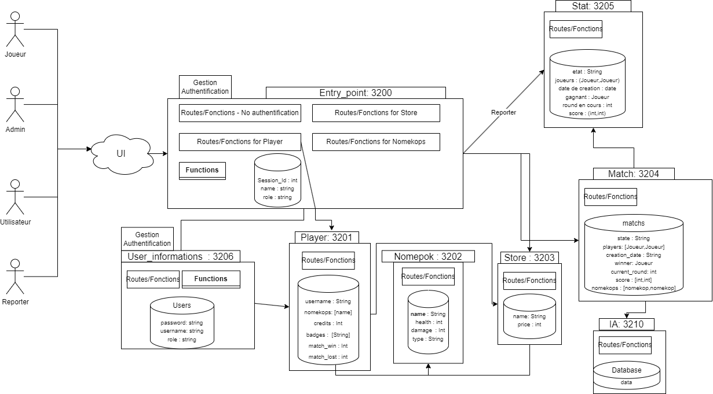
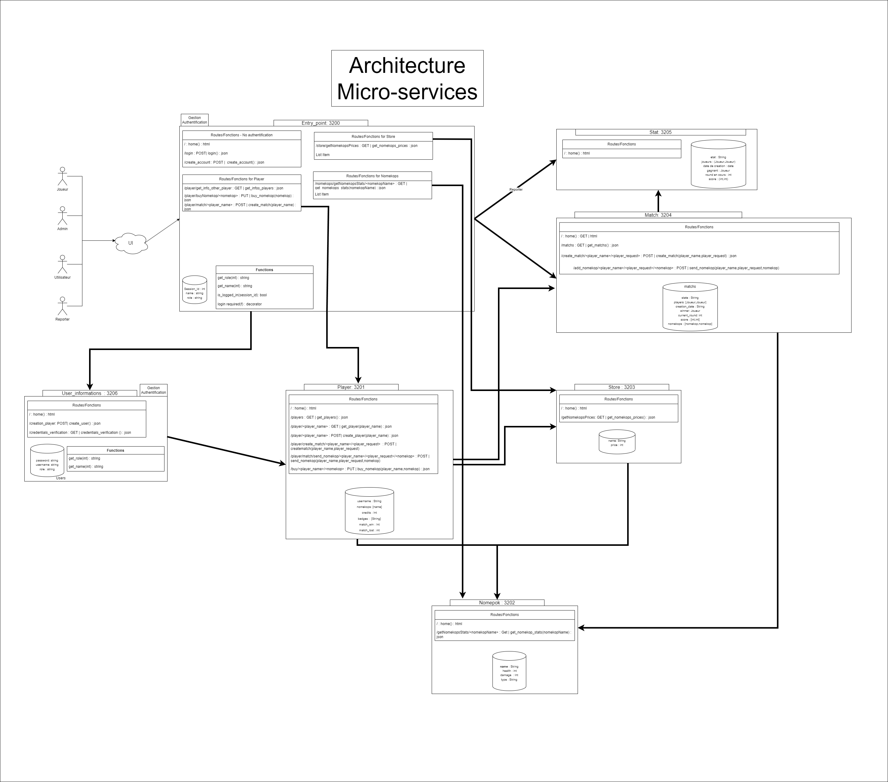

# micro-services-project-nomekop

## Overview
**Nomekops Project**  
*Date: 29.11.2022*  
*Authors: Eloi Lassarat, Nahuel Canavy*  
*GitHub Repository: [micro-services-project-nomekop](https://github.com/nahuel11500/micro-services-project-nomekop)*

### Abstract
This project orchestrates micro-services for an application similar to the Pokemon game. Players own "Nomekops" which they can collect and use to battle against other players to earn badges. This document describes the implemented functionalities and the adopted architecture.

## Business Domains

Given the project's scope, we chose to create a micro-service for each object type. The services include:

- **Player Service:** Manages player-related functionalities.
- **Nomekop Service:** Handles Nomekop-related operations.
- **Store Service:** Manages the in-game store functionalities.
- **Match Service:** Handles match-related operations.
- **Statistics Service:** Provides statistics and analytics.
- **User Data Service:** Manages user data storage and retrieval.
- **Entry Point Service:** Acts as the gateway and manages authentication.
### Some functionalities are not implemented ! Beware of that, this project is still under development. 

## Technology Stack
- **Backend:** Python with Flask framework for defining HTTPS routes.
- **Frontend:** Python with Curses library.
- **Data Storage:** JSON files.
- *Suggested Improvement:* Implement a NoSQL database service like Firebase for data management.

## Critical Path
The critical path involves sending a newly purchased Nomekop into a match. This process involves several steps, as detailed below:

1. **Login:** User authentication through the entry_point service.
2. **View Store:** Accessing the store to see available Nomekops and their prices.
3. **View Stats:** Checking statistics of Nomekops before purchase.
4. **Buy Nomekop:** Purchasing a Nomekop and updating user data.
5. **Send Nomekop to Arena:** Selecting and sending a Nomekop to participate in a match.

## Challenges
- **Authentication:** Implementing a secure yet accessible user authentication system.
- **User Interface:** Developing a user-friendly interface while maintaining efficient micro-service communication.
- **Technical Platform:** Usage of Flask, Python, Docker, and GitHub, without implementing CI/CD pipelines or Monitoring systems.

## Getting Started
To launch the project:

1. Start Docker containers:  
   `docker-compose up --build -d`
2. Launch the user interface:  
   `python .\UI\user_interface.py`

## Future Enhancements
- **Add AI Opponents:** Introduce AI-controlled opponents for matches.
- **Custom Nomekop Creation:** Enable users to create and propose their own Nomekops.
- **New Role - Creator:** Manage new Nomekop proposals through a dedicated 'creator' role.

## API Documentation
A complete schema of our API is provided for better understanding and usage.

An enhancement would be to create OPEN API schemas and add a swaggers. Feel free to do it ! 
